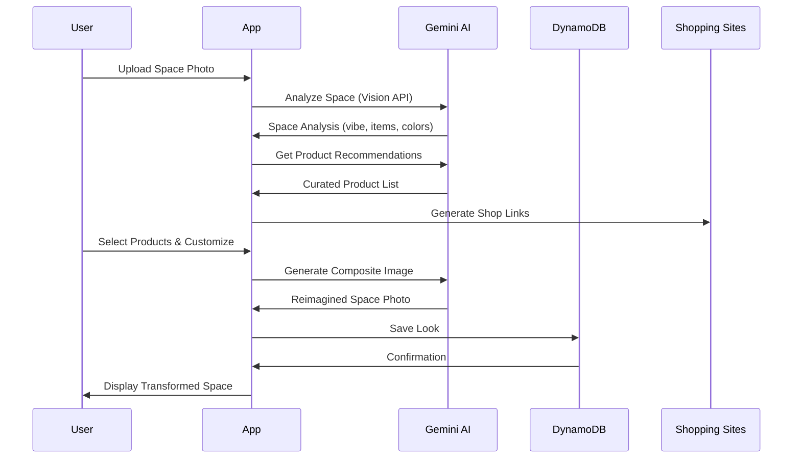
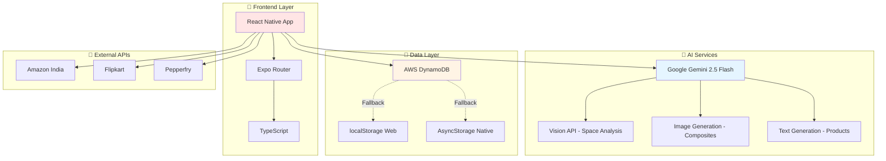
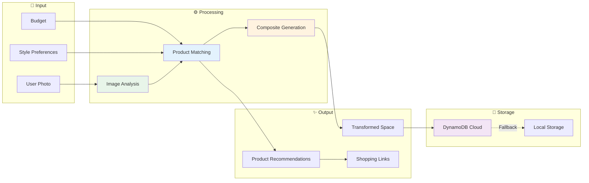

# 🌸 Bloom - AI Interior Design & Style Curator

> **Transform your space with AI.** Upload a photo of any room, garden, wardrobe, or collection, and get instant curated product recommendations with AI-powered visualization of your reimagined space.

[](https://www.typescriptlang.org/)
[](https://reactnative.dev/)
[](https://expo.dev/)
[](https://aws.amazon.com/dynamodb/)

[Live Demo](#) • [Documentation](#documentation) • [Report Bug](https://github.com/manish9701/Bloom/issues) • [Request Feature](https://github.com/manish9701/Bloom/issues)

---

## 📋 Table of Contents

- [Features](#-features)
- [How It Works](#-how-it-works)
- [Technical Architecture](#-technical-architecture)
- [Getting Started](#-getting-started)
- [Environment Setup](#-environment-setup)
- [Deployment](#-deployment-to-vercel)
- [Project Structure](#-project-structure)
- [API Integration](#-api-integration)
- [Contributing](#-contributing)

---

## ✨ Features

### 🎨 **AI-Powered Space Analysis**
- **Smart Detection**: Upload any photo - rooms, gardens, wardrobes, collections
- **Vibe Recognition**: AI identifies your space's aesthetic (Modern, Bohemian, Minimalist, etc.)
- **Item Detection**: Automatically detects furniture, decor, and existing items
- **Color Palette Extraction**: Identifies dominant colors for perfect matching

### 🛍️ **Intelligent Product Recommendations**
- **Budget-Aware**: Set your budget, get products that fit
- **Contextual Matching**: Products selected based on your space's style and needs
- **Smart Categories**: Furniture, lighting, textiles, plants, organization
- **Indian Market Focus**: Real products from Amazon India, Flipkart, Pepperfry, etc.
- **Alternative Options**: Budget and premium alternatives for each product

### 🎭 **AI Visualization**
- **Before/After Toggle**: See your space with recommended items
- **Realistic Compositing**: AI places products naturally in your photo
- **Multiple Variations**: Generate different looks with the same products
- **Style Customization**: Add custom style directions (e.g., "Japandi", "Dark Academia")

### 💾 **Cloud Persistence**
- **Gallery Management**: Save and organize all your looks
- **Cross-Device Sync**: DynamoDB cloud storage
- **Offline Fallback**: Works without internet using localStorage
- **Fast Access**: Instant loading with smart caching

### 🌐 **Multi-Platform**
- **Web**: Works in any modern browser
- **iOS**: Native app experience
- **Android**: Native app experience
- **Responsive**: Adapts to any screen size

---

## 🔄 How It Works



---

## 🏗️ Technical Architecture

### **System Architecture**



### **Data Flow**



### **Storage Strategy**

```
Priority System:
┌─────────────────────────────────────┐
│   1. AWS DynamoDB (Cloud)           │
│      ↓ (if unavailable)             │
│   2. localStorage (Web)             │
│      ↓ (if unavailable)             │
│   3. AsyncStorage (Native)          │
│      ↓ (if unavailable)             │
│   4. In-Memory (Session Only)       │
└─────────────────────────────────────┘
```

---

## 🚀 Getting Started

### **Prerequisites**

- **Node.js 20+** ([Download](https://nodejs.org))
- **npm** or **yarn** (comes with Node.js)
- **Expo Go** app for mobile testing ([Android](https://play.google.com/store/apps/details?id=host.exp.exponent) | [iOS](https://apps.apple.com/app/expo-go/id982107779))
- **Google AI API Key** ([Get it free](https://aistudio.google.com/app/apikey))

### **Installation**

```bash
# Clone the repository
git clone https://github.com/manish9701/Bloom.git
cd Bloom

# Install dependencies
npm install

# Copy environment template
cp .env.template .env

# Add your API keys to .env (see below)
```

---

## 🔑 Environment Setup

### **1. Create `.env` File**

Copy `.env.template` to `.env`:

```bash
cp .env.template .env
```

### **2. Add Your API Keys**

Edit `.env` and add:

```env
# Google AI (Gemini) API Key
EXPO_PUBLIC_GOOGLE_AI_KEY=your_google_ai_api_key_here

# AWS DynamoDB (Optional - for cloud storage)
AWS_REGION=us-east-1
AWS_ACCESS_KEY_ID=your_access_key_here
AWS_SECRET_ACCESS_KEY=your_secret_key_here
DYNAMO_TABLE_NAME=Bloom
```

### **3. Get Your API Keys**

#### **Google AI (Required)**
1. Go to [Google AI Studio](https://aistudio.google.com/app/apikey)
2. Click "Create API Key"
3. Copy and paste into `EXPO_PUBLIC_GOOGLE_AI_KEY`
4. **Free Tier**: 1,500 requests/day, 1M tokens/month

#### **AWS DynamoDB (Optional)**
Only needed for cloud storage. Without it, app uses localStorage.

1. Create AWS account: [aws.amazon.com](https://aws.amazon.com)
2. Go to IAM → Create user with DynamoDB permissions
3. Generate access keys
4. Add to `.env`
5. Run setup: `npm run setup:dynamodb`

### **4. Start the App**

```bash
npm start
```

Then:
- Press **`w`** for web browser
- Scan QR with **Expo Go** app for mobile
- Press **`a`** for Android emulator
- Press **`i`** for iOS simulator (Mac only)

---

## 🌐 Deployment to Vercel

### **Step 1: Install Vercel CLI**

```bash
npm install -g vercel
```

### **Step 2: Configure Environment Variables**

**⚠️ IMPORTANT**: For Vercel deployment, you MUST add environment variables through their dashboard:

1. Go to [Vercel Dashboard](https://vercel.com/dashboard)
2. Select your project
3. Go to **Settings** → **Environment Variables**
4. Add these variables:

```env
# Required for AI features
EXPO_PUBLIC_GOOGLE_AI_KEY=your_google_ai_api_key_here

# Optional - for cloud storage
AWS_REGION=us-east-1
AWS_ACCESS_KEY_ID=your_access_key
AWS_SECRET_ACCESS_KEY=your_secret_key
DYNAMO_TABLE_NAME=Bloom
```

**Important Notes:**
- ✅ **Use the SAME keys** from your local `.env` file
- ✅ Each key should be added separately
- ✅ Select **"Production"** environment
- ⚠️ **Never commit `.env`** file to GitHub
- ⚠️ Keys in Vercel are encrypted and secure

### **Step 3: Deploy**

```bash
# For web deployment
npm run build:web

# Deploy to Vercel
vercel --prod
```

Or use **GitHub Integration**:
1. Connect your GitHub repo to Vercel
2. Add environment variables in Vercel dashboard
3. Push to `main` branch
4. Auto-deploys! 🎉

### **Step 4: Verify Deployment**

After deployment:
1. Open your Vercel URL
2. Check browser console for: `[App] Google AI initialized`
3. Upload a test image
4. Verify AI analysis works

**Troubleshooting Deployment:**
- If AI fails: Check environment variables in Vercel dashboard
- If DynamoDB fails: Check AWS credentials (or disable by removing AWS env vars)
- If images don't load: Check CORS settings in AWS S3 (if using S3)

---

## 📁 Project Structure

```
Bloom/
├── 📱 app/                          # Application screens
│   ├── (tabs)/                      # Tab navigation
│   │   ├── index.tsx               # Home - Upload & analyze
│   │   ├── gallery.tsx             # Saved looks gallery
│   │   └── _layout.tsx             # Tab layout
│   ├── components/                  # Reusable components
│   │   ├── ui/                     # UI components
│   │   │   ├── Card.tsx
│   │   │   ├── Chip.tsx
│   │   │   ├── Shimmer.tsx
│   │   │   └── ...
│   │   ├── ImageViewer.tsx         # Full-screen image viewer
│   │   └── ...
│   ├── recommendations.tsx          # Product recommendations screen
│   ├── gallery-detail.tsx          # Look detail view
│   └── _layout.tsx                 # Root layout
│
├── 🔧 lib/                          # Core libraries
│   ├── aiService.ts                # Google AI integration
│   ├── dynamo.ts                   # DynamoDB service
│   ├── store.ts                    # Storage abstraction
│   ├── theme.ts                    # Design tokens
│   ├── config.ts                   # App configuration
│   └── mockData.ts                 # Demo data
│
├── 🎨 assets/                       # Static assets
│   ├── favicon.png
│   ├── splash-icon.png
│   └── ...
│
├── 🧪 scripts/                      # Helper scripts
│   ├── setup-dynamodb.js           # DynamoDB table setup
│   ├── test-dynamo.js              # Connection test
│   └── check-table-schema.js       # Schema verification
│
├── 📚 docs/                         # Documentation
│   ├── DYNAMO_SETUP.md             # DynamoDB guide
│   ├── README_DYNAMODB.md          # DynamoDB reference
│   └── DEPLOYMENT.md               # Deployment guide
│
├── ⚙️ Configuration
│   ├── .env.template               # Environment template
│   ├── app.json                    # Expo configuration
│   ├── tsconfig.json               # TypeScript config
│   ├── package.json                # Dependencies
│   └── babel.config.js             # Babel config
│
└── 📖 README.md                     # This file
```

---

## 🔌 API Integration

### **Google AI (Gemini 2.5 Flash)**

The app uses Google's Gemini AI for:

#### **1. Space Analysis** (Vision API)
```typescript
// Analyzes uploaded photo
const analysis = await analyzeSpace(imageUri);
// Returns: vibe, items, colors, category, strengths, issues
```

#### **2. Product Recommendations** (Text Generation)
```typescript
// Gets curated product list
const products = await getAIProductRecommendations(
  imageUri,
  category,
  vibe,
  budget
);
// Returns: Array of products with prices, links, match scores
```

#### **3. Image Compositing** (Image Generation)
```typescript
// Generates transformed space
const result = await generateComposite(
  imageUri,
  selectedProducts,
  vibe
);
// Returns: New image with products placed in scene
```

### **API Costs (Google AI Free Tier)**

| Feature | Model | Free Tier | Cost After |
|---------|-------|-----------|------------|
| Space Analysis | Gemini 2.5 Flash | 1,500/day | $0.075/1K requests |
| Products | Gemini 2.5 Flash | 1M tokens/month | $0.35/1M tokens |
| Composites | Gemini 2.5 Flash Image | 50/day | $0.25/image |

**Typical Usage Costs:**
- Analysis: ~$0.001 per photo
- Recommendations: ~$0.005 per request
- Composite: ~$0.25 per image
- **Total per look**: ~$0.26

**For Production:**
- Upgrade to Gemini API paid tier
- Or use caching for repeated analyses
- Implement rate limiting

---

## 🛠️ Available Scripts

```bash
# Development
npm start              # Start Expo dev server
npm run web            # Open in browser
npm run android        # Android device/emulator
npm run ios            # iOS simulator (Mac only)

# DynamoDB
npm run setup:dynamodb # Create DynamoDB table
npm run test:dynamo    # Test DynamoDB connection
npm run check:schema   # Verify table schema

# Quality
npm run typecheck      # TypeScript validation
npm run lint           # Code linting (if configured)

# Build
npm run build:web      # Build for web
```

---

## 🎯 Usage Examples

### **1. Analyze a Living Room**
```typescript
// Upload photo → AI detects:
// - Category: "Living Room"
// - Vibe: "Modern Minimalist"
// - Items: Sofa, TV Unit, Coffee Table
// - Issues: "Flat uniform lighting", "Cable clutter"
// - Suggestions: Ambient lighting, cable management
```

### **2. Get Product Recommendations**
```typescript
// Set budget: ₹10,000
// AI suggests:
// 1. Smart LED Bulb (₹799) - 93% match
// 2. Cable Box (₹649) - 89% match
// 3. Decorative Plant (₹499) - 91% match
// 4. Throw Pillows (₹599) - 87% match
// Total: ₹2,546 (under budget ✓)
```

### **3. Visualize Transformation**
```typescript
// Select products → Click "Reimagine"
// AI generates composite with products placed in scene
// Toggle Before/After to compare
// Save to gallery
```

---

## 🤝 Contributing

Contributions are welcome! Please follow these steps:

1. Fork the repository
2. Create a feature branch (`git checkout -b feature/AmazingFeature`)
3. Commit your changes (`git commit -m 'Add AmazingFeature'`)
4. Push to branch (`git push origin feature/AmazingFeature`)
5. Open a Pull Request

**Development Guidelines:**
- Use TypeScript strict mode
- Follow existing code style
- Add tests for new features
- Update documentation

---

## 📄 License

This project is licensed under the MIT License - see the [LICENSE](LICENSE) file for details.

---

## 🙏 Acknowledgments

- **Google AI** - Gemini 2.5 Flash for vision and generation
- **AWS** - DynamoDB for cloud storage
- **Expo** - Cross-platform framework
- **React Native** - Mobile development

---

## 📞 Support

- **Issues**: [GitHub Issues](https://github.com/manish9701/Bloom/issues)
- **Email**: your-email@example.com
- **Twitter**: [@yourhandle](https://twitter.com/yourhandle)

---

## 🗺️ Roadmap

- [ ] User authentication (AWS Cognito)
- [ ] Social sharing
- [ ] Furniture AR placement
- [ ] Multi-room projects
- [ ] Professional designer mode
- [ ] Marketplace integration

---

<div align="center">

**Made with ❤️ by [Your Name](https://github.com/manish9701)**

[⬆ Back to Top](#-bloom---ai-interior-design--style-curator)

</div>
